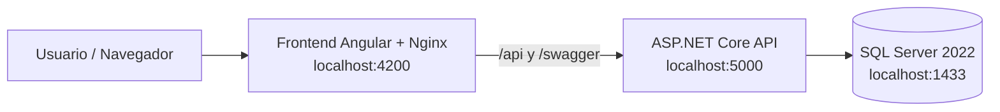

# Eventos Vivos

Sistema de gestión de eventos y reservas construido como prueba técnica Full Stack con ASP.NET Core Web API, Angular, SQL Server, Docker y despliegue preparado sobre Azure.

## Arquitectura Elegida y Justificación

La solución fue diseñada como un **Modular Monolith** basado en principios de **Clean Architecture** y **Onion Architecture**.

Aunque existen alternativas como microservicios, arquitecturas distribuidas, Event Sourcing o CQRS avanzado, para el alcance de esta prueba técnica se eligió un monolito modular porque ofrece mejor equilibrio entre simplicidad, mantenibilidad, testabilidad y preparación para evolución futura.

La decisión fue intencional y responde a criterio arquitectónico, no a una limitación técnica.

### Capas backend

| Capa | Responsabilidad |
|---|---|
| Domain | Entidades, Value Objects, enumeraciones, policies y reglas de negocio. No depende de infraestructura ni frameworks externos. |
| Application | Casos de uso, Commands, Queries, Handlers, validaciones, DTOs y contratos. Implementa CQRS ligero mediante MediatR. |
| Infrastructure | Entity Framework Core, SQL Server, repositorios, migraciones y servicios técnicos. Implementa contratos requeridos por Application. |
| API | ASP.NET Core Web API. Expone endpoints RESTful y mantiene controladores delgados delegando casos de uso a MediatR. |

### Principios aplicados

- Separation of Concerns.
- Single Responsibility Principle.
- Dependency Inversion Principle.
- Bajo acoplamiento y alta cohesión.
- Encapsulamiento de reglas de negocio.
- Testabilidad y mantenibilidad.

### Decisión técnica: moneda base

La moneda base del proyecto es **USD**.

Esta decisión mantiene la regla RN-05 del enunciado como una comparación literal: los eventos con precio mayor a **USD 100** limitan la reserva a máximo 10 entradas por transacción.

El sistema almacena importes como valores decimales simples y no implementa conversión multi-moneda. COP y otras monedas quedan fuera de alcance para evitar complejidad innecesaria en una prueba técnica centrada en reservas, capacidad y reglas de negocio.

### CQRS ligero

Las operaciones de escritura se modelan como **Commands** y las operaciones de lectura como **Queries**, usando MediatR para desacoplar controladores y casos de uso.

No se implementó CQRS avanzado ni Event Sourcing porque esas alternativas habrían agregado complejidad innecesaria para el dominio planteado.

## Requisitos Previos

Versiones identificadas en el proyecto y entorno de validación:

| Requisito | Versión / uso |
|---|---|
| .NET SDK | 10.0.301 (`net10.0`) |
| Node.js | 22.22.3 |
| npm | 10.9.8 |
| Angular | 22.x (`@angular/core`, `@angular/cli`) |
| Docker | 29.5.3 |
| Docker Compose | v5.1.4 |
| SQL Server local | `mcr.microsoft.com/mssql/server:2022-latest` |
| Base de datos cloud | Azure SQL Database Basic |

> Para ejecución local completa se recomienda Docker, porque levanta SQL Server, API y frontend con la misma configuración usada para validar la plataforma.

## Instrucciones para ejecutar localmente

### Opción A — Docker recomendada

1. Clonar el repositorio:

```bash
git clone https://github.com/CaportilloC/eventos-vivos.git
cd eventos-vivos
```

2. Crear variables de entorno locales:

```bash
cp .env.example .env
```

3. Verificar o ajustar la contraseña de SQL Server en `.env`:

```text
MSSQL_SA_PASSWORD=ChangeMe_StrongPassword123!
```

4. Levantar toda la plataforma:

```bash
docker compose --env-file .env -f docker/docker-compose.yml up -d --build
```

5. URLs locales disponibles:

| Servicio | URL |
|---|---|
| Frontend Angular + Nginx | <http://localhost:4200> |
| Swagger API | <http://localhost:5000/swagger> |
| API base | <http://localhost:5000/api/v1> |
| Health API | <http://localhost:5000/health/ready> |
| SQL Server | `localhost:1433` |

6. Detener servicios:

```bash
docker compose --env-file .env -f docker/docker-compose.yml down
```

7. Reiniciar desde cero, eliminando el volumen de SQL Server:

```bash
docker compose --env-file .env -f docker/docker-compose.yml down -v
```

### Opción B — Ejecución manual

La ejecución manual requiere tener disponible una instancia de SQL Server. La forma más simple es iniciar solo SQL Server con Docker y ejecutar backend/frontend desde el host.

#### Base de datos

1. Crear `.env` si no existe:

```bash
cp .env.example .env
```

2. Levantar SQL Server:

```bash
docker compose --env-file .env -f docker/docker-compose.yml up -d sqlserver
```

3. Cadena de conexión local esperada:

```text
Server=localhost,1433;Database=EventosVivosDb;User Id=sa;Password=<MSSQL_SA_PASSWORD>;TrustServerCertificate=True;Encrypt=False
```

#### Backend

1. Restaurar paquetes:

```bash
dotnet restore src/backend/EventosVivos.Api/EventosVivos.Api.csproj
```

2. Ejecutar la API en modo Development usando SQL Server local:

```bash
ConnectionStrings__EventosVivosDb="Server=localhost,1433;Database=EventosVivosDb;User Id=sa;Password=<MSSQL_SA_PASSWORD>;TrustServerCertificate=True;Encrypt=False" \
ASPNETCORE_ENVIRONMENT=Development \
DemoData__SeedOnStartup=true \
DemoData__ResetBeforeSeed=true \
dotnet run --project src/backend/EventosVivos.Api/EventosVivos.Api.csproj --urls http://localhost:5000
```

En `Development`, la API aplica migraciones automáticamente al iniciar y puede cargar datos demo cuando `DemoData__SeedOnStartup=true`.

#### Frontend

1. Instalar dependencias:

```bash
cd src/frontend/eventos-vivos-web
npm install
```

2. Ejecutar Angular:

```bash
npm start
```

3. URL local:

```text
http://localhost:4200
```

El frontend en modo desarrollo usa `proxy.conf.json`:

```text
/api     -> http://localhost:5000
/swagger -> http://localhost:5000
```

## Tecnologías Utilizadas

| Área | Tecnologías |
|---|---|
| Backend | .NET 10, ASP.NET Core Web API, MediatR, FluentValidation, Swashbuckle / Swagger |
| Frontend | Angular 22, Angular Material, Bootstrap 5.3, TypeScript 6, RxJS, SweetAlert2 |
| Base de Datos | SQL Server 2022, Entity Framework Core 10, EF Core Migrations |
| Testing | xUnit, Microsoft.AspNetCore.Mvc.Testing, Vitest, Angular unit testing, coverlet.collector |
| Infraestructura | Docker, Docker Compose, Nginx, SQL Server container, ASP.NET Core container |
| Cloud | Azure Container Registry, Azure Container Apps, Azure SQL Database, Log Analytics |
| CI/CD | GitHub Actions, Azure OIDC, Docker build/push, Azure Container Apps deployment |
| Herramientas de Desarrollo | Git, GitHub, Azure CLI, Docker CLI, npm, Angular CLI, .NET CLI |

## Docker

La plataforma incluye tres servicios en `docker/docker-compose.yml`:

| Servicio | Contenedor | Descripción |
|---|---|---|
| `sqlserver` | `eventosvivos-sqlserver` | SQL Server 2022 con volumen persistente |
| `api` | `eventosvivos-api` | ASP.NET Core Web API escuchando en `8080`, expuesta localmente en `5000` |
| `frontend` | `eventosvivos-frontend` | Angular compilado y servido por Nginx en `80`, expuesto localmente en `4200` |

El contenedor frontend usa Nginx para servir la SPA y proxyear:

```text
/api/*   -> API backend
/swagger -> Swagger backend
```



## Despliegue

La solución fue preparada y validada para despliegue en Azure usando contenedores.

### Recursos Azure utilizados

| Recurso | Nombre / URL |
|---|---|
| Resource Group | `rg-eventos-vivos` |
| Azure Container Registry | `eventosvivosacr.azurecr.io` |
| Azure Container Apps Environment | `cae-eventos-vivos` |
| Container App Backend | `api` |
| Container App Frontend | `frontend` |
| Azure SQL Server | `eventosvivos-sql-54a338-cu` |
| Azure SQL Database | `EventosVivosDb` |
| Log Analytics | `law-eventos-vivos` |

### URLs desplegadas

| Servicio | URL |
|---|---|
| Frontend | <https://frontend.redocean-9bd5eff0.eastus.azurecontainerapps.io> |
| API | <https://api.redocean-9bd5eff0.eastus.azurecontainerapps.io> |
| Swagger vía frontend | <https://frontend.redocean-9bd5eff0.eastus.azurecontainerapps.io/swagger> |
| Swagger directo API | <https://api.redocean-9bd5eff0.eastus.azurecontainerapps.io/swagger> |

### Imágenes desplegadas

| Aplicación | Imagen |
|---|---|
| Backend | `eventosvivosacr.azurecr.io/eventosvivos-api:azure-20260614-2328` |
| Frontend | `eventosvivosacr.azurecr.io/eventosvivos-frontend:azure-20260614-2326` |

### Estrategia

1. Compilar imágenes Docker de backend y frontend.
2. Publicar imágenes en Azure Container Registry.
3. Desplegar backend y frontend en Azure Container Apps.
4. Conectar backend a Azure SQL Database mediante cadena de conexión segura.
5. Exponer frontend públicamente y mantener el consumo de API mediante proxy `/api`.

## CI/CD

El repositorio implementa automatización con **GitHub Actions**.

| Workflow | Archivo | Propósito |
|---|---|---|
| CI | `.github/workflows/ci.yml` | Ejecuta build y tests de backend/frontend, más validación de Docker build. |
| Deploy Azure | `.github/workflows/deploy-azure.yml` | Construye imágenes Docker, las publica en ACR y actualiza Azure Container Apps. |

### CI

El workflow de CI corre en pull requests hacia `main` y valida:

- Restore, build y tests del backend .NET 10.
- SQL Server 2022 como servicio de pruebas para integración.
- Instalación, build y tests del frontend Angular 22.
- Build Docker de backend y frontend.

### Deploy Azure

El despliegue utiliza autenticación OIDC entre GitHub Actions y Azure, evitando credenciales largas dentro del repositorio.

El workflow de despliegue:

1. Autentica contra Azure mediante OIDC.
2. Construye imagen backend.
3. Publica imagen backend en Azure Container Registry.
4. Construye imagen frontend.
5. Publica imagen frontend en Azure Container Registry.
6. Actualiza la Container App `api`.
7. Espera health check del backend.
8. Actualiza la Container App `frontend`.
9. Ejecuta smoke tests contra API, frontend, proxy `/api` y Swagger.

El deploy puede ejecutarse manualmente con `workflow_dispatch` y también queda preparado para ejecutarse automáticamente al integrar cambios en `main`.

## Demo data

En Docker local, la API corre en `Development` y tiene habilitado el seeder demo:

```yaml
DemoData__SeedOnStartup: "true"
DemoData__ResetBeforeSeed: "true"
```

La carga demo incluye eventos, reservas y estados representativos para validar los flujos principales del sistema. Los precios demo están expresados en USD y preservan ambos lados de RN-05: eventos de hasta USD 100 y eventos mayores a USD 100.

Si una base local ya tiene datos sembrados con valores anteriores, usá `DemoData__ResetBeforeSeed=true` o reiniciá el volumen de SQL Server para regenerar los importes demo en USD. El reset borra eventos y reservas demo, pero mantiene los venues de referencia.

## Comandos útiles

### Validación frontend

```bash
cd src/frontend/eventos-vivos-web
npm run build
npm test -- --watch=false
```

### Validación backend

```bash
dotnet test tests/backend/EventosVivos.Tests/EventosVivos.Tests.csproj --nologo
```

### API local

```bash
curl http://localhost:5000/health/ready
curl http://localhost:5000/api/v1/events?pageNumber=1\&pageSize=20
curl http://localhost:5000/api/v1/reservations?pageNumber=1\&pageSize=50
```

### API desplegada

```bash
curl https://api.redocean-9bd5eff0.eastus.azurecontainerapps.io/health/ready
curl https://frontend.redocean-9bd5eff0.eastus.azurecontainerapps.io/api/v1/events?pageNumber=1\&pageSize=20
```

## Funcionalidad cubierta

- Gestión de eventos.
- Gestión de reservas pendientes.
- Confirmación de pago con código `EV-######`.
- Cancelación de reservas con regla de penalización de 48 horas.
- Reporte de ocupación por evento.
- Filtros y paginación en eventos, reservas y catálogos.
- Swagger/OpenAPI documentado.
